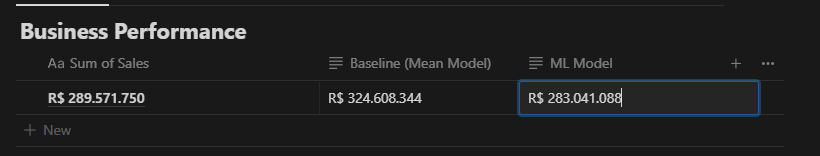
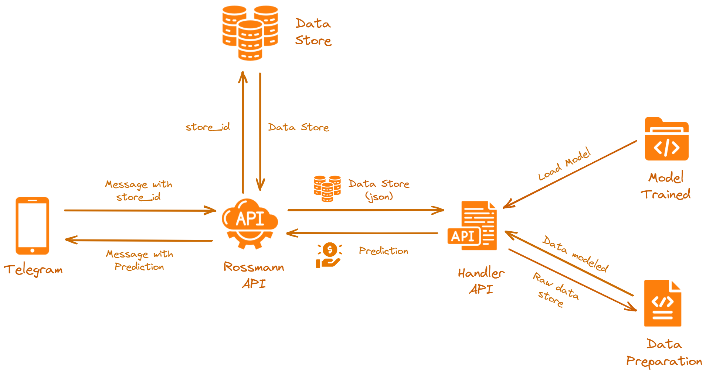

# Sales Forecast | Rossmann Drugstore Chain

# 1.0. Business problem

Rossmann's Chief Financial Officer will be implementing within the next weeks important remodeling across all units for the drugstore chain. 
To be able to complete such massive task, he decided to request from the Data Science team, a sales's projection for the next six weeks. With this information in hands, a responsible payment plan can be implemented with minimum financial risks to the stakeholders.  
*****
# 2.0. Understanding the Business

In this fictional scenario, our data source is a .csv file from a Kaggle competition, but it could be from the company's database, a set of spreadsheets, or other sources. You can access the data source on https://www.kaggle.com/c/rossmann-store-sales.

<li><strong>What's the motivation?</strong></li> Requested by the CFO to remodel the stores.

<li><strong> What is the root problem?</strong></li> Dificulty in determine the investment amount available for the remodeling.

<li><strong>What's the delivery method</strong></li> 
 

# Strategy

The Data team decided to implement the CRISP model ( Cross Industry Standard Process for Data Mining ). A ciclic and flexible methodology with quick turnaround.
A brief description below.

*****
# 3.0 Business Assumptions

Rossmann Pharmacy expected gross income is betweeen R$5000 and R$22000. 

<li><strong>Stores sortment aren't equivalent in terms of type and quantity.</strong></li> 
<li><strong>Opening days vary from store to store</li> 
<li><strong>There are seasonal promotions that affect some but not all stores across</li> 

*****
# 4.0 Data Collection

After data collection, the data cleaning step began. This step covered some topics such as:
 
 <strong>Step 1. Data Description: </strong>The types of variables available in the dataset were checked and transformed to the most convenient types.
 
 <strong>2. Treatment of null values: </strong> At this stage, a set of assumptions was assumed to fill in these values ​​and can be checked in more detail in the notebook of this project.
 
 <strong>Step 3. Data Filtering: </strong> Finally, variables considered irrelevant for our project were removed, such as the days on which the stores were closed. In addition, variables that would not be available at the time of prediction, such as the number of customers, were excluded.
 *****
 
 # 5.0  Exploratory Data Analysis
 
In order to understand how the variables impact the sales phenomenon and the intensity of this impact, the business team built a list of hypotheses that will then be put to the test by the data team. Below is shown some of the hypotheses and their subsequent validation or invalidation by the tests performed.
 *****

# 6.0 Data Modelling
Since the learning of machine learning algorithms is facilitated with numerical data that are on the same scale, Rescaling, Encoding and Transformation techniques were applied in order to prepare the data for training the machine learning model.
 
 <strong>6.1. Numerical Variables</strong>
 As most of the numerical variables in the set do not have a normal distribution, Rescaling methods were applied.
 
 <strong>6.2. Categorical Variables</strong>
 For variables such as *store_type* and *assortment*, which are categorical in nature, **Label Encoding** was used
 
 <strong>6.3. Scalling</strong>
 As our response variable, sales, does not have a normal distribution, in order to facilitate learning the algorithm, a logarithm-type transformation was applied
 
 <strong>6.4. Transformation </strong>
 In order to respect the cyclical nature of temporal variables such as day, day of the week, week and month, sine and cosine cyclic transformations were applied.
 
 <strong>6.5. Feature Selection </strong>
 Finally, the Boruta algorithm was used in order to identify the features with greater relevance to the model. The variables indicated by Boruta as being the best   were chosen for model training.
 
 *****
 
# 7.0 Machine Learning Algorythms
 
<strong>7.1. Assumptions </strong> 
Given the business question presented, we then have a **Regression** problem, since the response variable must be a real value (in our case, the sales value of each store)

Thus, tests were carried out with 4 algorithms where the one that presented the best performance was selected for the model
Since we still don't know whether the nature of the sales phenomenon is linear or non-linear, we selected 2 linear and 2 non-linear algorithms.

The algorithms selected for the test were:
 
- Linear Regressor
- Linear Regressor Regularized (Lasso)
-  Random Forest Regressor
-  XGBoost

<strong>7.2. Time Series Validation</strong>
 
The algorithms were evaluated using the cross validation technique, which can be illustrated in the image below:

From the entire available data set, a portion is separated for training and another for testing and then the performance is evaluated.

- In a second iteration, another portion of the data is used for training and another for testing.
- In a third iteration, the training and validation plots are modified again and so on (always respecting the data chronology), until the entire data set is used.

This process is important for us to evaluate the model from several different perspectives, presenting a more reliable result of its real performance.

<strong> 7.3. Performance</strong>

Applying the Cross Validation Time Series technique to the chosen algorithms, we obtain the following results:
Although the Random Forest algorithm had the best performance, the chosen algorithm for this first CRISP cycle was XGBoost. This is due to the fact that this algorithm is leaner than Random Forest.

This will make it easier to deploy this model, in addition to saving space on the servers, which is an important requirement for this project.
*****
 
 
<strong> 8.0. Performance</strong>

An overview of the model's performance and the magnitude of its intrinsic error can be seen in the graph below.
 

 
 
#8.1. Business Performance
 
 After choosing our algorithm, we are now able to analyze the performance of the model from a business point of view.

Below we can compare 3 main scenarios:

1. The actual sum of sales for all stores during the 6 weeks
2. The sum of sales in the scenario where the average sales of each store is generalized over 6 weeks (Mean Model)
3. The sum of sales predicted by the model
 

*****
#9.0 Production Model
With the model selected, trained and evaluated with a good performance, it's time to put it into production. For this, we chose to make the project predictions available online through the Telegram messaging application.
 In this application, the user must inform a bot created in Telegram the ID of the store which he wants to obtain the sales forecast for the next 6 weeks. Thus, the bot will return a message with the prediction
 
 To carry out this task, it was necessary to create two APIs whose structures will be detailed in the topics below.
 
 I hosted the app on Heroku ( will be changing platform ) 

 #9.1. API Call
 This API will be responsible for returning the sales forecast based on store attributes.
 For the prediction to be made, it is necessary to inform the API of the attributes of the store on the day in question, such as assortment, store_type, day of the week, etc. Based on this information, the handler.py file loads the trained model, models the data by applying transformations and rescalings, and then performs the prediction.
 
 In response to this query, the same set of API input data is returned in json format plus an element that informs the sales forecast value for the requested store(s) and day(s) .

The figure below seeks to illustrate how this process works.

 
 
 
#9.2. Telegram BOT
 
 This API is responsible for communicating with the end user, managing welcome messages, error messages and responses to forecast requests.
 
 Once the user performs a query by informing the ID of the store he wants the forecast to be, the ***rossmann-bot.py*** file loads the attribute data of the store that is now in production (the user no longer needs to inform them), performs some treatments, transforms it into json, and then performs a query on the previously presented API, handler.py.
 
 
 This API, as reported, returns a json with the input data plus the forecast value for each of the stores. Finally, ***rossmann-bot.py*** transforms this json, adds the predictions and informs the user via a message, the total value of the sales forecasts for the next 6 weeks

The figure below seeks to illustrate this process in full:
 
 ***IMAGE***

 
